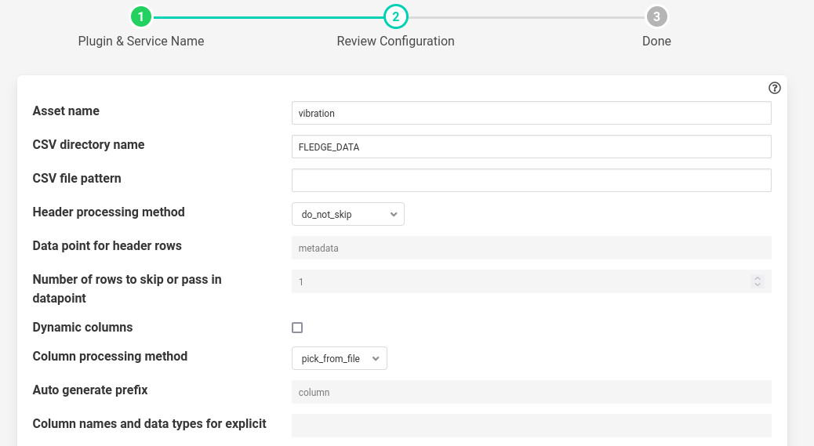
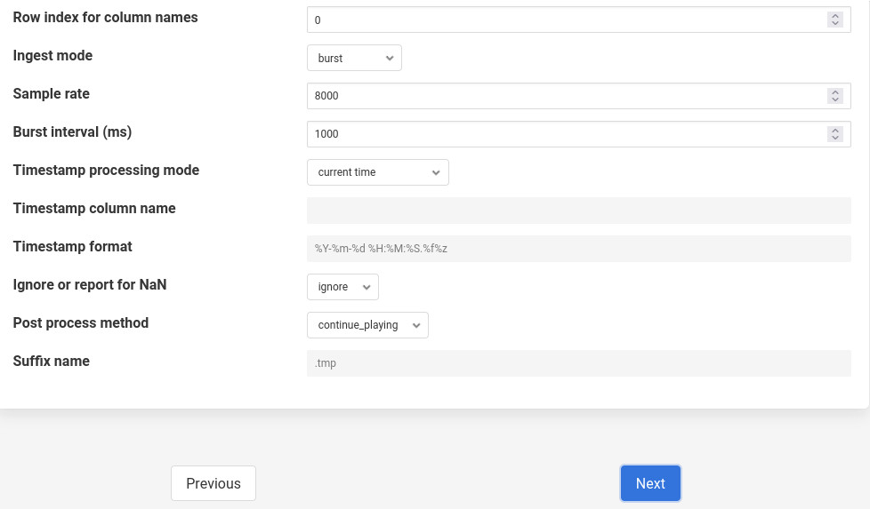

CSV Playback
============

The plugin plays a csv file inside some given directory in file system (The default being FLEDGE_ROOT/data). It converts the columns of csv file into readings which are datapoints of an output asset.
The plugin plays readings at some configured rate.

We can also convert the columns of csv file into some other data type. For example from float to integer. The converted data will be part of reading not the CSV file.

The plugin has the ability to play the readings in either burst or continuous mode. In burst mode all readings are ingested into database at once and there is no adjustment of timestamp of a single reading. Whereas in continuous mode readings are ingested one by one and the timestamp of each reading is adjusted according to sampling rate. (For example if sampling rate is 8000 then the user_ts of every reading differs by 125 micro seconds.)

We can also copy the timestamp if present in the CSV file. This time stamp becomes the user_ts of a reading.

The plugin can also play the file in a loop which means it can start again if end of the file has reached.

The plugin can also play a file that has variable columns in every line.

|config1|

  - **'assetName': type: string default: 'vibration'**:
                The output asset that contains the readings.

  - **'csvDirName': type: string default: 'FLEDGE_DATA'**:
                The directory where CSV file exists. Default is FLEDGE_DATA or FLEDGE_ROOT/data

  - **'csvFileName': type: string default: ''**:
                CSV file name or pattern to search inside directory. Not necessarily an exact file name.
                If there are multiple files matching with the pattern, then the plugin will pick the first file in
                alphabetical order. If postProcessMethod is rename or delete then it will rename or delete the played
                file and pick the next one and so on.

  - **'headerMethod': type: enumeration default: 'do_not_skip'**:
                The method for processing the header of csv file.

                1. skip_rows : If this is selected then the plugin will skip a given number of rows. The number of rows should be given in noOfRows config parameter given below.

                2. pass_in_datapoint : If this is selected then the given no of rows will be combined into a string. This string will be present inside some given datapoint. Useful in cases where we want to ingest meta data along with readings from the csv file.

                3. do_not_skip: This option will not take any action on the header.

  - **'dataPointForCombine': type: string default: 'metadata'**:
                If header method is pass_in_datapoint then it is the datapoint name
                where the given number of rows will get combined.

  - **'noOfRows': type: integer default: '1'**:
                No. of rows to skip or combine to single value. Used when headerMethod is either skip_rows or pass_in_datapoint.

  - **'variableCols': type: boolean default: 'false'**:
                It should be set true when the columns in every row
                of CSV is variable. For example
                If you have a file like this

                a,b,c

                2,3,,23

                4

                Then you should set it true.

                .. note::
                    Only one reading will be ingested at a time in this case. If you want to increase the rate then increase
                    readingPerSec parameter in advanced plugin configuration.

   - **'columnMethod': type: enumeration default: 'pick_from_file'**:
                If variable Columns is false then it indicates how columns are considered.

                1. pick_from_file : The columns will be picked using a row index given.

                2. explicit : Specify the columns inside useColumns parameter.

   - **'autoGeneratePrefix': type: string default: 'column'**:
               If variable Columns is set true then data points will generated using the prefix.
               For example if there is row like this 1,,2 and we chose autoGeneratePrefix to be column, then we will get data points like this column_1: 1, column_3: 2. Empty values will be ignored.

  - **'useColumns': type: string default: ''**:
                Format **column1:type,column2:type**

                The data types supported are:
                int, float, str, datetime, bool

                We can perform three tasks with this config parameter.

                1. The column name will get renamed in the reading if different name is used other than present in CSV file.
                2. We can select a subset of columns from total columns.
                3. We can convert the data type of each column.

                Example if the file is like the following

                    id,value,status

                    1,2.5,'OK'

                    2,2.7,'OK'

                Then we can give

                1. id:int,temperature:float,status:str

                The column value will be renamed to temperature.

                2. id:int,value:float

                Only two columns will be selected here.

                3. id:int,temperature:int,status:str

                The data type will be converted to integer. Also column will be renamed.

|config2|

   - **'rowIndexForColumnNames': type: integer default: '0'**:
                If column method is pick_from_file then it is the index where
                from where column names are taken.

  - **'ingestMode': type: enumeration default: 'burst'**:
                Burst or continuous mode for ingestion.

  - **'sampleRate': type: integer default: '8000'**:
                No of readings per second to ingest.

  - **'burstInterval': type: integer default: '1000'**:
                Used for burst mode. Time interval between consecutive bursts in milliseconds.

  - **'timestampStyle': type: enumeration default: 'current time'**:
                Controls how to give timestamps to reading. Works in four ways:

                1. current time: The timestamp in the readings is whatever the local time in the machine.
                2. copy csv value: Copy the timestamp present in the CSV file.
                3. move csv value: Used when we do not want to include timestamps from files in actual readings.
                4. use csv sample delta: Pick the delta between two readings in the file and construct the timestamp of reading using this delta. Assuming the delta remains constant through out the file.)

  - **'timestampCol': type: string default: ''**:
                The timestamp column to pick from the file. Used only when timestampStyle is not 'current time'.

  - **'timestampFormat': type: string default: '%Y-%m-%d %H:%M:%S.%f%z'**:
                The timestamp format that will be used to parse the time stamps present in the file.  Used only when timestampStyle is not 'current time'.

  - **'ignoreNaN': type: enumeration default: ignore**:
                Pandas takes the white spaces and missing values as NaN's. These NaN's cause problem while ingesting into database.
                It is left to the user to ensure there are no missing values in CSV file. However if the option selected is report. Then plugin will check for NaN's and report error to user. This can serve as a way to check the CSV file for missing values. However the user has to take action on what to do with NaN values. The default action is to ignore them.
                When error is reported the user must delete the south service and try again with clean CSV file.

   - **'postProcessMethod': type: enumeration default: 'continue_playing'**:
                It is the method to process the CSV file once all rows are ingested.
                It could be:

                1. continue_playing

                   Play the file again if finished.

                2. delete

                   Delete the played file once finished.

                3. rename

                   Rename the file with suffix after playing.

   - **'suffixName': type: string default: '.tmp'**:
                The suffix name for renaming the file if postProcess method is rename.

Execution
---------

Assuming you have a csv file named vibration.csv inside FLEDGE_ROOT/data/csv_data. The csv file has fixed number of columns per row.  Also assuming the column names are present in the first line. The plugin will rename the file with suffix .tmp after playing. Here is the curl command for that.

    .. code-block:: console

       res=$(curl -sX POST http://localhost:8081/fledge/service -d  @- << EOF | jq '.'
       {
        "name":"My_south",
        "type":"south",
        "plugin":"csvplayback",
        "enabled":false,
        "config": {
             "assetName":{"value":"My_csv_asset"},
             "csvDirName":{"value":"FLEDGE_DATA/csv_data"},
             "csvFileName":{"value":"vib"},
             "headerMethod":{"value":"do_not_skip"},
             "variableCols":{"value":"false"},
             "columnMethod":{"value":"pick_from_file"},
             "rowIndexForColumnNames":{"value":"0"},
             "ingestMode":{"value":"burst"},
             "sampleRate":{"value":"8000"},
             "postProcessMethod":{"value":"rename"},
             "suffixName":{"value":".tmp"}
                 }
        }
        EOF
        )

        echo $res

Poll Vs Async
-------------

The plugin also works in async mode. Though the default mode is poll.
The async mode is faster but suffers with memory growth when sample rate is too high for the machine configuration

Use the following sed operation for async and start the plugin again. (The second sed operation can be used if you want to revert back to poll mode. Restart the plugin in that case also.)

.. code-block:: console

    plugin_path=$FLEDGE_ROOT/python/fledge/plugins/south/csvplayback/csvplayback.py
    value='s/POLL_MODE=True/POLL_MODE=False/'
    sudo sed -i $value $plugin_path

    # for reverting back to poll the commands  will be
    plugin_path=$FLEDGE_ROOT/python/fledge/plugins/south/csvplayback/csvplayback.py
    value='s/POLL_MODE=False/POLL_MODE=True/'
    sudo sed -i $value $plugin_path

Behaviour Under various mode
----------------------------

The behaviour of plugin under various modes.

.. list-table::
   **Behaviour of CSV playback plugin**
   :widths: 15 15 70
   :header-rows: 1

   * - Plugin mode
     - Ingest mode
     - Behaviour
   * - poll
     - burst
     - No memory growth. Resembles the way sensors give data in real life. However the timestamps of readings won't differ by a fixed delta.
   * - poll
     - continuous
     - No memory growth. Readings differ by a constant delta. However it is slow in performance.
   * - async
     - continuous
     - Similar to poll continuous but faster. However memory growth is observed over time.
   * - async
     - burst
     - Similar to poll burst. Not used generally.

For using poll mode in continuous setting increase the readingPerSec category to the sample rate.

.. code-block:: console

      sampling_rate=8000
      curl -sX PUT http://localhost:8081/fledge/category/My_southAdvanced -d '{"bufferThreshold":"'"$sampling_rate"'","readingsPerSec":"'"$sampling_rate"'"}' |jq

It is advisable to increase the buffer threshold at least half the sample rate for good performance. (As done in above command)

